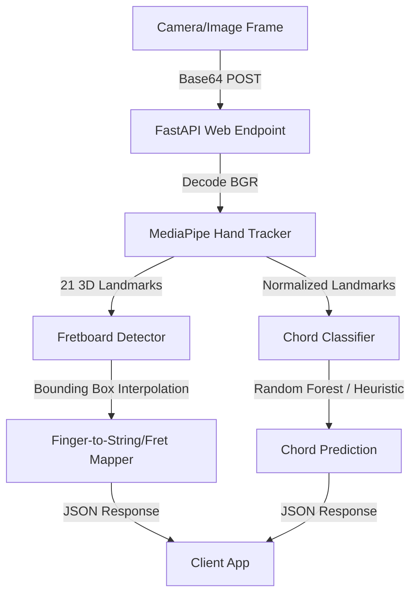

# Guitar Trainer ML Service: Current Capabilities

The Machine Learning (ML) service is a Python-based computer vision backend designed to analyze live video frames and assess a player's guitar chord fingering. Here is the summary of what the service does so far:

---

## 1. Hand Tracking & Coordinate Extraction
* **Framework**: Google MediaPipe Tasks (`0.10.35`) with the official Hand Landmarker model and CPU delegate.
* **Process**: Captures raw camera/image frames and extracts **21 distinct 3D landmarks** corresponding to key anatomical locations of the hand (wrist, thumb joints, and the four finger joints/tips).
* **Coordinates**: Returns $x, y, z$ coordinates normalized between $0.0$ and $1.0$ relative to the image boundaries.

## 2. Scale & Orientation Normalization
* **Method**: Landmarks are translated relative to the wrist (landmark 0) and scaled proportionally based on the maximum distance from the wrist to any joint.
* **Why**: This ensures hand size, hand angle, and distance from the camera do not distort the chord recognition, making the model highly robust to different players and setups.

## 3. Guitar Neck & Fretboard Detection
* **Framework**: OpenCV (Hough Line Transform implemented for calibration; Bounding Box interpolation for mapping).
* **Process**: The system can analyze line structures to identify the neck, or use an overlay bounding box (`neck_bbox`) provided by the client.
* **Finger-to-Fret Mapping**: Maps normalized coordinates of the fingertips to:
  * **String number**: 1 to 6 (where 1 is the high E string and 6 is the low E string).
  * **Fret number**: 0 to 5 (where 0 is open / no fret pressed / outside bounds).

## 4. Chord Classification Engine
* **Machine Learning Model**: Includes a scikit-learn **Random Forest Classifier** trained to predict chord shapes from the flattened 63-element feature vector of normalized hand landmark 3D coordinates.
* **Heuristic Fallback**: If a trained model is not yet loaded, a rule-based classifier evaluates the finger extensions relative to standard shapes (specifically targeting chords like **G Major**, **C Major**, and **E Minor**).
* **Outputs**: Returns the predicted chord string (or `"Unknown_or_Open"`) along with a confidence probability score.

## 5. REST API (FastAPI)
* Exposes a POST endpoint at `/api/process-frame` accepting base64 encoded images.
* Validates incoming requests and structures outgoing JSON data using **Pydantic schemas**.
* Returns whether a hand was detected, the normalized landmarks, the chord classification, and the individual finger string/fret mappings in a structured payload.
