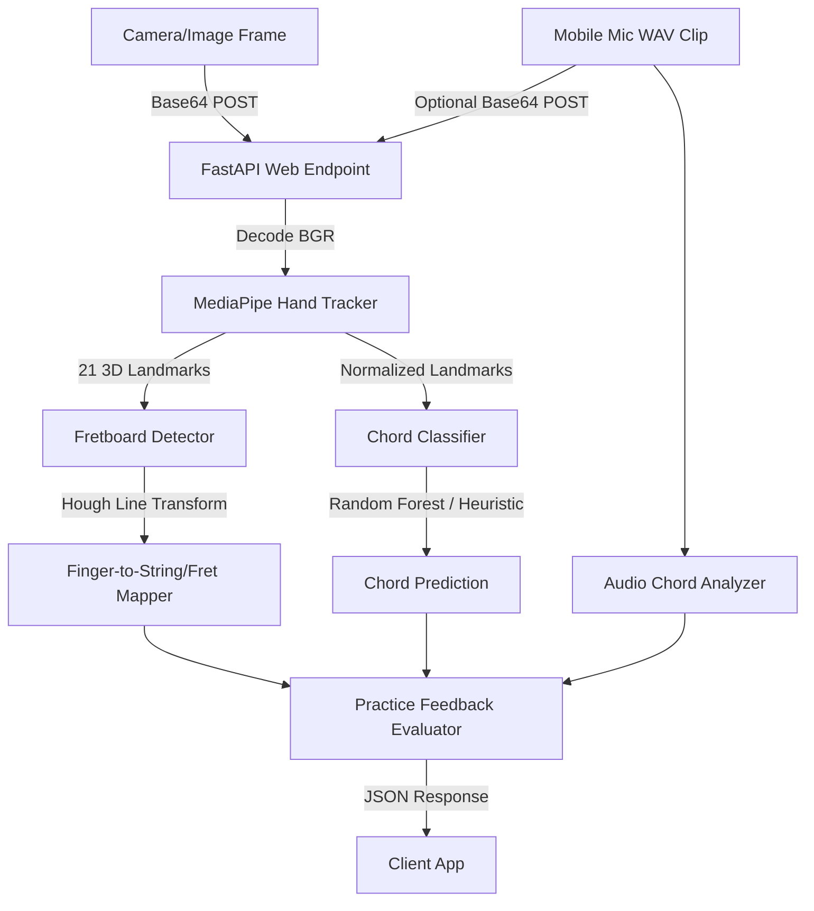

# Guitar Trainer Machine Learning Service

This service provides real-time computer vision and machine learning analysis for the Guitar Trainer application. It is a Python-based backend that processes camera frames to detect hands, extract 3D landmarks, map fingers to guitar strings/frets, and recognize chord shapes.

---

## 🛠️ Architecture & Modules



The service is structured as follows:

```text
ml-service/
├── requirements.txt         # Python dependencies (FastAPI, MediaPipe, OpenCV, scikit-learn)
├── summary.md               # This documentation file
├── test_service.py          # Sanity check/validation script
├── ML_TODO.md               # Handover guide detailing what is incomplete
└── app/
    ├── __init__.py          # App package initialization
    ├── main.py              # FastAPI application entrypoint & CORS setup
    ├── api/
    │   ├── __init__.py
    │   ├── routes.py        # API routing (/health, /process-frame, /analyze-practice)
    │   └── schemas.py       # Pydantic request/response validation schemas
    ├── audio/
    │   └── chord_audio.py    # Lightweight FFT/chroma audio chord matching
    ├── practice/
    │   └── chord_feedback.py # Target-chord placement/audio feedback rules
    └── vision/
        ├── __init__.py
        ├── hand_tracking.py # MediaPipe Hands integration (extracts 21 3D landmarks)
        ├── fingering_classifier.py  # Scale-invariant feature extraction & Chord classification
        └── fretboard_detection.py   # Guitar neck line detection & finger-to-string/fret mapping
```

### 1. Vision & ML Pipeline (`app/vision/`)
* **Hand Tracking (`hand_tracking.py`)**: Uses Google MediaPipe Hands to capture 21 distinct 3D landmarks on a user's hand (coordinates $x, y, z$).
* **Fingering Classifier (`fingering_classifier.py`)**:
  * Translates coordinates relative to the wrist (landmark 0) and normalizes them by scale to ensure accuracy regardless of hand size or camera distance.
  * Predicts chord shapes using a scikit-learn Random Forest model.
  * Falls back to a robust rule-based heuristic classifier if no trained ML model is loaded (supports G Major, C Major, and E Minor).
* **Fretboard Detection (`fretboard_detection.py`)**:
  * Employs OpenCV Hough Line Transforms to detect guitar neck edges/lines.
  * Maps normalized finger coordinates to specific string numbers (1-6) and fret numbers (0-5, where 0 is open).
* **Audio Chord Analysis (`audio/chord_audio.py`)**:
  * Accepts a short base64 encoded WAV clip from the mobile microphone.
  * Uses FFT energy folded into pitch classes to compare the sound against supported beginner chord triads.
  * Returns the closest detected chord, confidence, and the strongest pitch classes.
  * Rejects oversized clips and unsupported formats with frontend-actionable messages. Current supported audio format is WAV.
* **Live Practice Feedback (`practice/chord_feedback.py`)**:
  * Compares the selected target chord against detected finger placement and audio.
  * Supports common alternate fingerings for beginner chords instead of forcing one exact hand shape.
  * Produces a machine-readable status such as `correct`, `fix_fingering`, `check_tuning_or_strum`, `need_audio`, `resync_audio_video`, or `no_hand_detected`.
  * Returns short instructions suitable for a frontend flashcard, banner, or camera overlay.
* **Session Smoothing (`practice/session_smoothing.py`)**:
  * Uses an optional frontend `session_id` to smooth repeated live-practice responses over a short rolling window.
  * Helps prevent flickering feedback from one noisy camera frame or audio clip.

### 2. FastAPI Web Layer (`app/api/`)
* **API Schemas (`schemas.py`)**: Defines Pydantic data schemas. Client requests send a base64 encoded camera frame (JPEG/PNG) and optionally custom guitar neck coordinates.
* **Routes (`routes.py`)**:
  * `GET /api/health`: Confirms the service status.
  * `POST /api/process-frame`: Processes raw base64 frame, runs the detection pipeline, and returns whether a hand is detected, the 3D landmarks, the predicted chord with confidence, and individual finger-to-fret mappings.
  * `POST /api/analyze-practice`: Processes the selected target chord, a camera frame, and an optional WAV audio clip, then returns combined finger-placement and sound feedback for live chord practice.

### 3. Live Mobile Practice Flow
The frontend should capture camera frames and microphone audio on the mobile device, then send them through the backend to the ML service:

```json
{
  "session_id": "practice-session-123",
  "target_chord": "C",
  "image": "data:image/jpeg;base64,...",
  "audio": "data:audio/wav;base64,...",
  "audio_format": "wav",
  "frame_timestamp_ms": 1710000000000,
  "audio_timestamp_ms": 1710000000100,
  "neck_bbox": null
}
```

The response includes `status`, `raw_status`, `stable_status`, `overall_score`, `summary`, `instruction`, per-finger feedback, timing warnings, and audio feedback. Recommended UI mapping:
* `correct`: show a positive confirmation.
* `fix_fingering`: show the returned `instruction` near the chord diagram or camera preview.
* `check_tuning_or_strum`: tell the user the shape looks close, but the guitar may need tuning or the strum may be muted.
* `need_audio`: ask for a clear strum.
* `resync_audio_video`: capture/send audio and video closer together in time.
* `no_hand_detected`: ask the user to move the fretting hand into the camera view.

For mobile integration, send compressed camera frames under 3 MB and short WAV audio clips under 2 MB. If the mobile recorder produces AAC/M4A, convert that clip to WAV before sending it to the ML service, or add a server-side decoder later.

---

## 🚀 How to Run the Service

### 1. Install Dependencies
Run the following command in the `ml-service` folder:
```bash
pip install -r requirements.txt
```

### 2. Run Local Validation Tests
Verify that all vision and math modules load correctly using the validation script:
```bash
python test_service.py
```

### 3. Start the Web Server
Launch the FastAPI development server as a Python module from the `ml-service` folder:
```bash
python -m app.main
```
Or run it via `uvicorn` directly:
```bash
uvicorn app.main:app --reload --port 8000
```
The interactive API documentation will be available locally at: [http://127.0.0.1:8000/docs](http://127.0.0.1:8000/docs)
