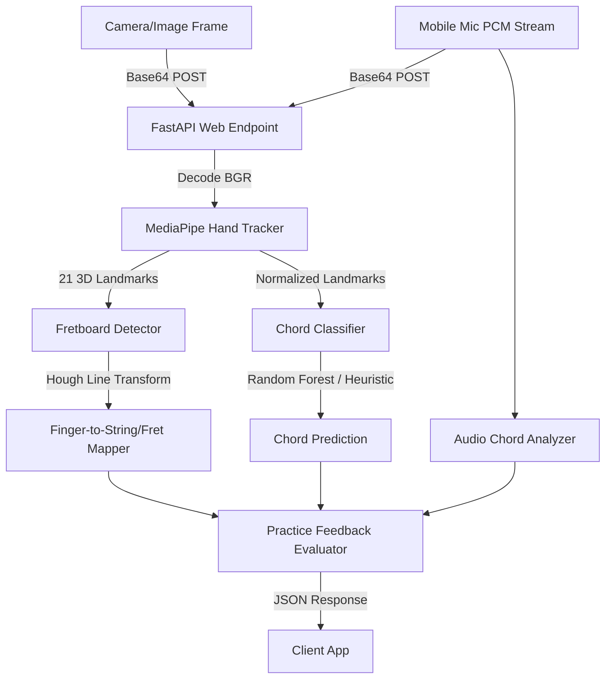

# Guitar Trainer Machine Learning Service

This service provides real-time computer vision and machine learning analysis for the Guitar Trainer application. It is a Python-based backend that processes camera frames to detect hands, extract 3D landmarks, map fingers to guitar strings/frets, and recognize chord shapes.

---

## 🛠️ Architecture & Modules



The service is structured as follows:

```text
ml-service/
├── requirements.txt         # Python dependencies (FastAPI, MediaPipe, OpenCV, scikit-learn)
├── summary.md               # This documentation file
├── test_service.py          # Sanity check/validation script
├── ML_TODO.md               # Handover guide detailing what is incomplete
└── app/
    ├── __init__.py          # App package initialization
    ├── main.py              # FastAPI application entrypoint & CORS setup
    ├── api/
    │   ├── __init__.py
    │   ├── routes.py        # API routing (/health, /process-frame, /analyze-practice)
    │   └── schemas.py       # Pydantic request/response validation schemas
    ├── audio/
    │   └── chord_audio.py    # Lightweight FFT/chroma audio chord matching
    ├── practice/
    │   ├── chord_feedback.py  # Target-chord placement/audio feedback rules
    │   └── session_smoothing.py # Bounded, thread-safe temporal smoothing
    └── vision/
        ├── __init__.py
        ├── hand_tracking.py # MediaPipe Hands integration (extracts 21 3D landmarks)
        ├── fingering_classifier.py  # Scale-invariant feature extraction & Chord classification
        └── fretboard_detection.py   # Guitar neck line detection & finger-to-string/fret mapping
```

### 1. Vision & ML Pipeline (`app/vision/`)
* **Hand Tracking (`hand_tracking.py`)**: Uses Google MediaPipe Hands to capture 21 distinct 3D landmarks on a user's hand (coordinates $x, y, z$).
* **Fingering Classifier (`fingering_classifier.py`)**:
  * Translates coordinates relative to the wrist (landmark 0) and normalizes them by scale to ensure accuracy regardless of hand size or camera distance.
  * Predicts chord shapes using a scikit-learn Random Forest model.
  * Falls back to a robust rule-based heuristic classifier if no trained ML model is loaded (supports G Major, C Major, and E Minor).
* **Fretboard Detection (`fretboard_detection.py`)**:
  * Employs OpenCV Hough Line Transforms to detect guitar neck edges/lines.
  * Maps normalized finger coordinates to specific string numbers (1-6) and fret numbers (0-5, where 0 is open).
* **Audio Chord Analysis (`audio/chord_audio.py`)**:
  * Accepts base64 WAV, signed 16-bit PCM, or float32 PCM from the mobile microphone.
  * Uses frame-wise FFT energy folded into pitch classes to compare sound against every major, minor, and diminished triad.
  * Returns the closest detected chord, confidence, and the strongest pitch classes.
  * Rejects oversized clips and unsupported formats with frontend-actionable messages. Current supported audio format is WAV.
* **Live Practice Feedback (`practice/chord_feedback.py`)**:
  * Compares the selected target chord against detected finger placement and audio.
  * Uses the exact position variants returned by the chord backend, with local beginner shapes as a fallback.
  * Requires the measured string and fret for every expected finger to match; classifier confidence does not override a wrong placement.
  * Produces a machine-readable status such as `correct`, `fix_fingering`, `check_tuning_or_strum`, `need_audio`, `resync_audio_video`, or `no_hand_detected`.
  * Returns short instructions suitable for a frontend flashcard, banner, or camera overlay.
* **Session Smoothing (`practice/session_smoothing.py`)**:
  * Uses an optional frontend `session_id` to smooth repeated live-practice responses over a short rolling window.
  * Helps prevent flickering feedback from one noisy camera frame or audio clip.
  * Expires inactive sessions and caps retained sessions so long-running servers do not grow memory without bound.

### 2. FastAPI Web Layer (`app/api/`)
* **API Schemas (`schemas.py`)**: Defines Pydantic data schemas. Requests accept JPEG/PNG or packed RGB frames, WAV/raw PCM audio, backend fingering variants, and optional guitar-neck coordinates.
* **Routes (`routes.py`)**:
  * `GET /api/health`: Confirms the service status.
  * `POST /api/process-frame`: Processes raw base64 frame, runs the detection pipeline, and returns whether a hand is detected, the 3D landmarks, the predicted chord with confidence, and individual finger-to-fret mappings.
  * `POST /api/analyze-practice`: Processes the selected target chord, a camera frame, and optional audio, then returns combined finger-placement and sound feedback for live chord practice.

### 3. Live Mobile Practice Flow
The frontend uses VisionCamera video and frame outputs concurrently. Audio Studio records a separate WAV file and supplies raw PCM chunks for analysis. Requests flow through `POST /ml/analyze-practice` on the Rust backend, which proxies them to this service:

```json
{
  "session_id": "practice-session-123",
  "target_chord": "C",
  "image": "<base64 packed RGB>",
  "image_format": "rgb",
  "image_width": 216,
  "image_height": 384,
  "audio": "<base64 signed 16-bit PCM>",
  "audio_format": "pcm_s16le",
  "audio_sample_rate": 16000,
  "audio_channels": 1,
  "expected_fingerings": [
    {
      "index": { "string": 2, "fret": 1 },
      "middle": { "string": 4, "fret": 2 },
      "ring": { "string": 5, "fret": 3 }
    }
  ],
  "neck_bbox": {
    "top_left": [0.08, 0.38],
    "top_right": [0.92, 0.38],
    "bottom_left": [0.08, 0.63],
    "bottom_right": [0.92, 0.63]
  }
}
```

The response includes `status`, `raw_status`, `stable_status`, `overall_score`, `summary`, `instruction`, per-finger feedback, timing warnings, and audio feedback. Recommended UI mapping:
* `correct`: show a positive confirmation.
* `fix_fingering`: show the returned `instruction` near the chord diagram or camera preview.
* `check_tuning_or_strum`: tell the user the shape looks close, but the guitar may need tuning or the strum may be muted.
* `need_audio`: ask for a clear strum.
* `resync_audio_video`: capture/send audio and video closer together in time.
* `no_hand_detected`: ask the user to move the fretting hand into the camera view.

The camera screen waits for three agreeing responses before showing feedback and automatically hides each feedback message after five seconds. The saved video and WAV paths are stored together and synchronized during playback.

---

## 🚀 How to Run the Service

### 1. Install Dependencies
Run the following command in the `ml-service` folder:
```bash
pip install -r requirements.txt
```

### 2. Run Local Validation Tests
Run the deterministic practice-logic tests:
```bash
python -m unittest discover -s tests -v
```
Verify that the full vision and math modules load correctly using the validation script:
```bash
python test_service.py
```

### 3. Start the Web Server
Launch the FastAPI development server as a Python module from the `ml-service` folder:
```bash
python -m app.main
```
Or run it via `uvicorn` directly:
```bash
uvicorn app.main:app --reload --port 8000
```
The interactive API documentation will be available locally at: [http://127.0.0.1:8000/docs](http://127.0.0.1:8000/docs)

### 4. Run the Full Mobile Flow
Start PostgreSQL/Redis as required by the backend, then run these in separate terminals from the repository root:
```bash
cd ml-service
python -m app.main
```
```bash
cd guitar-backend
cargo run
```
For a physical phone, replace `<mac-lan-ip>` with the Mac's Wi-Fi IP. `127.0.0.1` points to the phone itself and will not reach the backend:
```bash
cd guitar-frontend
EXPO_PUBLIC_API_BASE_URL=http://<mac-lan-ip>:8080 npx expo run:ios
```
Use `npx expo run:android` for Android. This feature uses native frame and audio modules, so it does not run in Expo Go. After the development build is installed, use `npx expo start --dev-client` for later JavaScript-only changes.

On iOS, the audio recorder requires deployment target 16.4. The GPU frame resizer also requires Xcode's Metal Toolchain component. Android builds require a configured JDK and Android SDK.

## Current Model Limitations

The live pipeline is functional, but the bundled chord-shape classifier was trained from a very small landmark dataset and is not evidence of production accuracy. Placement decisions therefore use calibrated fingertip-to-string/fret geometry and backend chord positions as the source of truth. Before release, collect labeled video from multiple players, phones, lighting conditions, left/right-handed guitars, and camera angles, and evaluate on players who were not included in training. The next optimization should move hand-landmark inference on-device and send landmarks instead of RGB frames; this reduces latency, bandwidth, and server cost while preserving the same feedback API.
