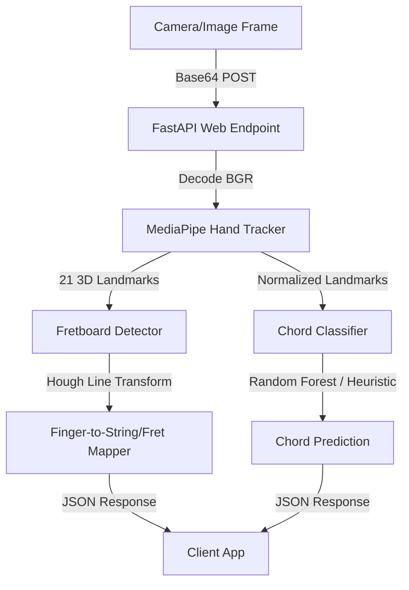

# Guitar Trainer Machine Learning Service

This service provides real-time computer vision and machine learning analysis for the Guitar Trainer application. It is a Python-based backend that processes camera frames to detect hands, extract 3D landmarks, map fingers to guitar strings/frets, and recognize chord shapes.

---

## 🛠️ Architecture & Modules



The service is structured as follows:

```text
ml-service/
├── requirements.txt         # Python dependencies (FastAPI, MediaPipe, OpenCV, scikit-learn)
├── summary.md               # This documentation file
├── test_service.py          # Sanity check/validation script
├── ML_TODO.md               # Handover guide detailing what is incomplete
└── app/
    ├── __init__.py          # App package initialization
    ├── main.py              # FastAPI application entrypoint & CORS setup
    ├── api/
    │   ├── __init__.py
    │   ├── routes.py        # API routing (/health, /process-frame)
    │   └── schemas.py       # Pydantic request/response validation schemas
    └── vision/
        ├── __init__.py
        ├── hand_tracking.py # MediaPipe Hands integration (extracts 21 3D landmarks)
        ├── fingering_classifier.py  # Scale-invariant feature extraction & Chord classification
        └── fretboard_detection.py   # Guitar neck line detection & finger-to-string/fret mapping
```

### 1. Vision & ML Pipeline (`app/vision/`)
* **Hand Tracking (`hand_tracking.py`)**: Uses Google MediaPipe Hands to capture 21 distinct 3D landmarks on a user's hand (coordinates $x, y, z$).
* **Fingering Classifier (`fingering_classifier.py`)**:
  * Translates coordinates relative to the wrist (landmark 0) and normalizes them by scale to ensure accuracy regardless of hand size or camera distance.
  * Predicts chord shapes using a scikit-learn Random Forest model.
  * Falls back to a robust rule-based heuristic classifier if no trained ML model is loaded (supports G Major, C Major, and E Minor).
* **Fretboard Detection (`fretboard_detection.py`)**:
  * Employs OpenCV Hough Line Transforms to detect guitar neck edges/lines.
  * Maps normalized finger coordinates to specific string numbers (1-6) and fret numbers (0-5, where 0 is open).

### 2. FastAPI Web Layer (`app/api/`)
* **API Schemas (`schemas.py`)**: Defines Pydantic data schemas. Client requests send a base64 encoded camera frame (JPEG/PNG) and optionally custom guitar neck coordinates.
* **Routes (`routes.py`)**:
  * `GET /api/health`: Confirms the service status.
  * `POST /api/process-frame`: Processes raw base64 frame, runs the detection pipeline, and returns whether a hand is detected, the 3D landmarks, the predicted chord with confidence, and individual finger-to-fret mappings.

---

## 🚀 How to Run the Service

### 1. Install Dependencies
Run the following command in the `ml-service` folder:
```bash
pip install -r requirements.txt
```

### 2. Run Local Validation Tests
Verify that all vision and math modules load correctly using the validation script:
```bash
python test_service.py
```

### 3. Start the Web Server
Launch the FastAPI development server as a Python module from the `ml-service` folder:
```bash
python -m app.main
```
Or run it via `uvicorn` directly:
```bash
uvicorn app.main:app --reload --port 8000
```
The interactive API documentation will be available locally at: [http://127.0.0.1:8000/docs](http://127.0.0.1:8000/docs)
